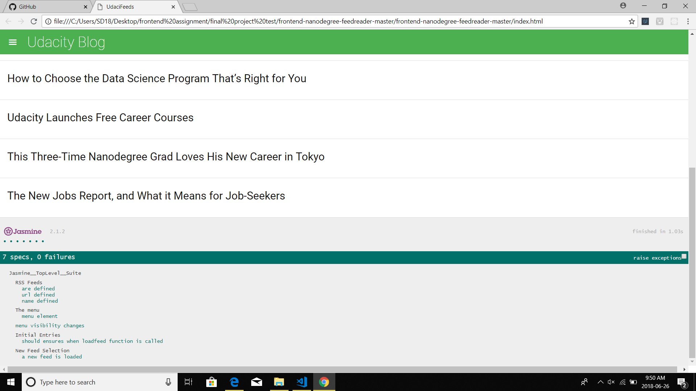

# Project Overview
In this project there is  a web-based application that reads RSS feeds.

## Why this Project?

Testing is an important part of the development process. I write tests first, before i start developing application. All the tests initially failed and then  start writing application code to make these tests pass.

## Testing specs

## What  I learned

I have learned how to use Jasmine to write a number of tests . It has the event handling and DOM manipulation.

## How this helpful is this 

 Good tests give you the ability to quickly analyze whether new code breaks an existing feature within your codebase, without having to manually test all of the functionality.

## Author

Sukhdeep sidhu
